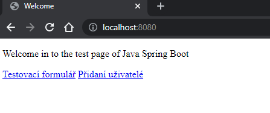
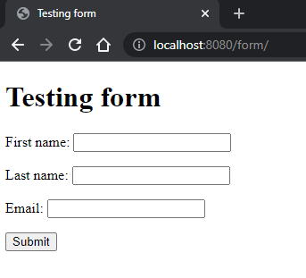
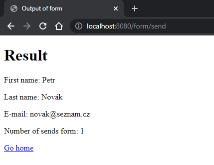
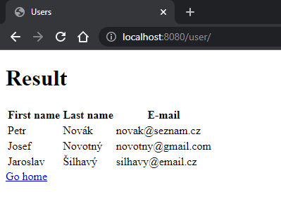

# Cvičení 03 - @Controller a @Service
### Popis projektu
* Projekt demonstruje využití: 
    * @Controller
    * @Service
    * @Scope 
    * @RequestMapping
    * @GetMapping
    * @PostMapping
    * @DeleteMapping
    * Jednoduchý formulář
    * Jednoduché získání dat

Projekt je zaměřen na "vytvoření uživatelů", jejich následné zobrazení, případně i mazání.

#####Úvodní stránka

* Obsahuje jednoduché menu
    * Testovací formulář: formulář pro přidání uživatele
    * Přidaní uživatelé: Všichni přidaní uživatelé
#####Formulář pro přidání uživatele

* Jednoduchý formulář pro přidání uživatele
* Po stisku submit se odešle POST request na form/send, kde se dále zpracuje
#####Stránka oznamující přidání uživatele

* Jednoduchý výpis toho, co jsme zapsali v předchozím formuláři
* A počet odeslání formuláře (to je realizováno pomocí FormService (Scope = session))
#####Stránka vypisující uživatele

* Jednoduchý výpis uživatelů

### Ukázkové requesty a response
* Vybrané requesty, které nejsou reprezentovány v prohlížeči
1. DELETE All
   
   Request: DELETE http://localhost:8080/user/deleteAll
   
Response:

    <!DOCTYPE html>
    <html>
    <head>
        <meta http-equiv="Content-Type" content="text/html; charset=UTF-8"/>
        <title>Deleted user</title>
    </head>
    <body>
    1 user/s was deleted
    </body>
    </html>
    
    Response code: 200; Time: 37ms; Content length: 209 bytes

2. DELETE by ID

  Request: DELETE http://localhost:8080/user/delete?id=1

Response:

    <!DOCTYPE html>
    <html>
    <head>
        <meta http-equiv="Content-Type" content="text/html; charset=UTF-8"/>
        <title>Deleted user</title>
    </head>
    <body>
    1 user/s was deleted
    </body>
    </html>
    
    Response code: 200; Time: 56ms; Content length: 209 bytes

  

